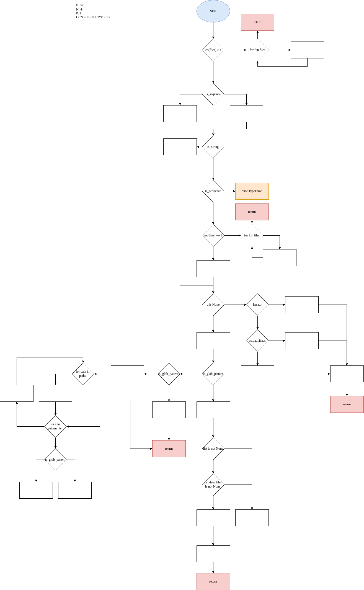

# 

[](
    https://travis-ci.org/numpy/numpy)
[](
    https://ci.appveyor.com/project/charris/numpy)
[](
    https://dev.azure.com/numpy/numpy/_build/latest?definitionId=5)
[](
    https://codecov.io/gh/numpy/numpy)

NumPy is the fundamental package needed for scientific computing with Python.

- **Website (including documentation):** https://www.numpy.org
- **Mailing list:** https://mail.python.org/mailman/listinfo/numpy-discussion
- **Source:** https://github.com/numpy/numpy
- **Bug reports:** https://github.com/numpy/numpy/issues

It provides:

- a powerful N-dimensional array object
- sophisticated (broadcasting) functions
- tools for integrating C/C++ and Fortran code
- useful linear algebra, Fourier transform, and random number capabilities

Testing:

- NumPy versions &ge; 1.15 require `pytest`
- NumPy versions &lt; 1.15 require `nose`

Tests can then be run after installation with:

    python -c 'import numpy; numpy.test()'

[](https://numfocus.org)

## Part 1: Complexity measurement

Ten python functions with high (>15)  _cyclomatic complexity_ (CNN) according to lizard:

```
================================================
  NLOC    CCN   token  PARAM  length  location
------------------------------------------------
     59     18    375      2     150 add_data_files@1184-1333@./distutils/misc_util.py
     61     22    467      2     120 add_data_dir@1054-1173@./distutils/misc_util.py
     49     17    363      1      57 finalize_options@86-142@./distutils/command/build_src.py
     41     16    311      3      80 CCompiler_customize@468-547@./distutils/ccompiler.py
     52     20    420      3      54 get_paths@663-716@./distutils/system_info.py
     65     17    392      1      71 get_atlas_version@1465-1535@./distutils/system_info.py
     47     17    294      1      63 setup@109-171@./distutils/core.py
     35     16    272      4      56 _exec_command@265-320@./distutils/exec_command.py
     38     16    245      2      55 _scalar_str@115-169@./core/_dtype.py
     34     17    238      1      57 long_double_representation@345-401@./core/setup_common.py
```

### Manual cyclomatic complexity

The cyclomatic complexity of a function can be calculated through two different methods:

 1. \pi - s + 2, where 
       \pi is the number of decisions made.
	   s is the number of terminating statements.

 2. Drawing the control flow graph and calculating CNN = E - N + 2 * P, where
       E is the number of edges in the graph.
	   N is the number of nodes in the graph.
	   P is the number of connected components in the graph.

#### add\_data\_file 

The function `add_data_file` in `numpy/distutils/misc_utils.py` adds data files to configuration\_data\_files. The function has a cyclomatic complexity number (CCN) of 13 and is moderately long. Accoring to lizard the CCN of the function should be 18 which implies that lizard probably calculates the CNN in some other way. Exceptions were taken into consideration during the calculation. A possible reason for the high CCN could be that the function supports many different file path formats (absolute- and relative file name, etc.) which results in a lot of branchs. As seen in the functions  control flow graph below a lot of the branchs terminates. We could improve CCN of the function by simply splitting these branches into separate functions.



#### finalize\_options 

The function `finalize_options` in `numpy/distutils/command/build_src.py` is not documented but the file `build_src.py` is used for building swig and f2py sources. The `finalize_options` function seems to be setting build settings for building these sources. The function has a cyclomatic complexity number (CCN) of 17 and is moderately long but is mostly made up of if-statements. `lizard` gives the same cyclomatic complexity number (CCN) of 17. Since the function checks a lot of options to see if they are empty or not in order to either give that option the set value or a default value there are a lot of if-statements which explain the high CCN. There are no exceptions in the thrown function.

## Part 2: Coverage measurement and improvement

Initial code coverage output data generated by `./coverage`.

```
Name                                                                                         Stmts   Miss Branch BrPart  Cover   Missing
----------------------------------------------------------------------------------------------------------------------------------------
build/testenv/lib64/python3.6/site-packages/numpy/f2py/func2subr.py                            228    218    144      0     3%   32-77, 81-183, 187-263, 267-299
build/testenv/lib64/python3.6/site-packages/numpy/f2py/crackfortran.py                        2533   2356   1701      1     4%   204-230, 236-241, 266-270, 274, 278-282, 286, 290-297, 310-326, 340-534, 618-630, 633-638, 655-796, 800-814, 818-834, 837-838, 842-869, 886-889, 893-900, 908-1447, 1451-1457, 1461-1484, 1498-1509, 1513-1533, 1539-1677, 1681-1733, 1738-1759, 1763-1773, 1777-1787, 1791-1793, 1801-1804, 1808-1813, 1819-1843, 1849-1875, 1886-1971, 1975-2005, 2009-2048, 2054-2082, 2086-2101, 2105-2108, 2114-2162, 2168-2314, 2320-2336, 2340-2344, 2350-2364, 2369-2375, 2380-2391, 2397-2410, 2414-2499, 2503-2505, 2511-2521, 2527-2870, 2876-2909, 2913-2936, 2947-2955, 2959-2998, 3006-3075, 3079-3085, 3089-3109, 3113-3122, 3131-3243, 3250-3257, 3263-3271, 3274-3345, 3273->3274
build/testenv/lib64/python3.6/site-packages/numpy/f2py/f2py2e.py                               417    388    273      0     4%   40-41, 177-314, 318-351, 355-385, 389-395, 419-461, 468-479, 483-484, 491-655, 659-685
build/testenv/lib64/python3.6/site-packages/numpy/distutils/command/build_ext.py               359    332    192      0     5%   44-46, 49-72, 75-282, 286, 289-469, 480-485, 491-518, 522-579, 582-586, 589-598
build/testenv/lib64/python3.6/site-packages/numpy/f2py/diagnose.py                             131    124     22      1     5%   10-12, 16-154, 156, 155->156
build/testenv/lib64/python3.6/site-packages/numpy/distutils/command/build_src.py               542    492    262      0     6%   30-44, 69-84, 87-142, 145-148, 152-168, 171-203, 207-226, 229-255, 259-282, 285-306, 310-346, 349-385, 388, 391, 394-402, 405-439, 443-454, 462, 465-600, 606-714, 726-734, 737-745, 748-752, 762-772
build/testenv/lib64/python3.6/site-packages/numpy/f2py/capi_maps.py                            484    441    316      4     6%   188-213, 242-284, 288-312, 317-374, 379-448, 452-466, 470-501, 513-606, 616-687, 694-716, 720-733, 741-815, 819-837, 84->105, 122->141, 154->158, 182->188
build/testenv/lib64/python3.6/site-packages/numpy/f2py/f90mod_rules.py                         171    156     68      0     6%   37-47, 91-272
build/testenv/lib64/python3.6/site-packages/numpy/f2py/cb_rules.py                             110     98     74      0     7%   442-449, 454-577
build/testenv/lib64/python3.6/site-packages/numpy/f2py/common_rules.py                         107     96     50      0     7%   32-48, 52-148
build/testenv/lib64/python3.6/site-packages/numpy/testing/_private/nosetester.py               184    165     72      0     7%   39-61, 99-112, 167-196, 215-233, 236-253, 262-263, 279-327, 400-480, 540-553, 557-561
build/testenv/lib64/python3.6/site-packages/numpy/f2py/rules.py                                272    241    142      0     8%   1163-1337, 1346-1470
build/testenv/lib64/python3.6/site-packages/numpy/distutils/command/build_clib.py              192    168     94      1     9%   22, 41-44, 47-53, 56-59, 62-65, 68-124, 127-131, 134-135, 139-323, 21->22
build/testenv/lib64/python3.6/site-packages/numpy/distutils/mingw32ccompiler.py                307    266    140      2    10%   21, 43-44, 67-167, 187-211, 217-243, 255-284, 287-288, 295-321, 325-347, 350-406, 409-418, 422-454, 457-474, 479-520, 541-558, 563-590, 605-612, 620-623, 629-630, 634-636, 640-641, 644-655, 20->21, 540->541
build/testenv/lib64/python3.6/site-packages/numpy/f2py/f2py_testing.py                          37     31     18      0    11%   10-19, 23-48
build/testenv/lib64/python3.6/site-packages/numpy/distutils/command/config.py                  267    225     90      0    12%   36-37, 40-87, 90-102, 105-110, 115-162, 167-168, 174-185, 189-201, 207-230, 234-313, 321-346, 376-407, 413, 418, 422, 425, 428, 438-489, 494-496, 499-500, 503, 506
build/testenv/lib64/python3.6/site-packages/numpy/f2py/use_rules.py                             44     36     24      0    12%   55-87, 91-115
build/testenv/lib64/python3.6/site-packages/numpy/distutils/conv_template.py                   173    145     42      1    13%   113-136, 140-142, 151-155, 177-212, 216-257, 260-262, 269-286, 289-296, 304-313, 317-334, 337, 336->337
build/testenv/lib64/python3.6/site-packages/numpy/distutils/core.py                            139    114     86      4    13%   7-15, 51-55, 58-72, 78-92, 104, 106, 111-171, 174-200, 203-217, 6->7, 48->51, 102->104, 105->106
build/testenv/lib64/python3.6/site-packages/numpy/testing/tests/test_decorators.py             138    118     32      0    13%   20, 32-36, 39-53, 56-76, 79-104, 107-132, 135-165, 168-197, 203-214
build/testenv/lib64/python3.6/site-packages/numpy/testing/_private/decorators.py                72     58     30      0    14%   22-23, 63-64, 94-97, 131-171, 206-228, 255-273, 288-290
build/testenv/lib64/python3.6/site-packages/numpy/distutils/command/autodist.py                 29     23      8      0    16%   11-29, 33-46, 50-61, 66-79, 83-96
build/testenv/lib64/python3.6/site-packages/numpy/distutils/command/build_scripts.py            35     27     16      0    16%   13-35, 38-47, 50-51
build/testenv/lib64/python3.6/site-packages/numpy/distutils/command/config_compiler.py          81     63     32      0    16%   10-18, 50-59, 62-82, 86, 100, 103-124, 128
build/testenv/lib64/python3.6/site-packages/numpy/distutils/command/install_headers.py          21     16     10      0    16%   9-27
build/testenv/lib64/python3.6/site-packages/numpy/distutils/misc_util.py                      1167    915    572     19    17%   18-19, 27-32, 76-78, 99-100, 109-115, 120-125, 129-130, 135-144, 154-175, 189, 196, 201, 207-230, 236, 277-282, 289-300, 311-319, 333, 346-348, 354-369, 372, 374, 376, 378, 380, 382, 387-389, 394-399, 403-408, 412-419, 423-430, 443-454, 463, 471-472, 476, 479-482, 487-495, 499-502, 506-509, 516-531, 536-540, 544-549, 565, 570-580, 583-590, 596-615, 620-629, 632-633, 636-647, 674, 683-692, 697-713, 716, 721-727, 763-837, 849-856, 859-860, 863, 876-880, 884-885, 890-904, 912-948, 968-1009, 1030-1051, 1110-1173, 1176-1182, 1272-1333, 1344-1350, 1360-1367, 1387-1401, 1413-1414, 1419-1424, 1474-1527, 1558-1562, 1568-1579, 1625-1630, 1692-1700, 1711-1718, 1721-1743, 1746-1756, 1762-1770, 1777-1779, 1792-1798, 1811-1817, 1822-1831, 1836-1868, 1873-1910, 1926-1981, 1999-2023, 2040-2064, 2074, 2082-2086, 2090-2099, 2103-2108, 2151, 2217-2226, 2235-2242, 2246-2254, 2258-2259, 2284-2327, 2332-2335, 2340-2341, 105->109, 187->189, 194->196, 200->201, 235->236, 240->246, 271->297, 275->277, 286->289, 306->308, 324->333, 334->348, 338->348, 350->368, 462->463, 673->674, 680->683, 2150->2151, 2257->2258
build/testenv/lib64/python3.6/site-packages/numpy/f2py/auxfuncs.py                             537    401    284      0    17%   65-66, 70, 74, 79, 83, 87, 93, 97, 101, 105, 110, 114, 118, 122-128, 132-136, 140-144, 148-152, 156-160, 164-168, 172-176, 180-184, 188-190, 194, 199, 204, 209, 214, 219, 224, 229, 234, 239, 244, 248, 252, 256, 260, 263-265, 269, 273-275, 279-286, 290, 294-302, 306-314, 318-326, 330-338, 342-352, 356-364, 368, 372, 377, 381, 386, 390, 394-408, 412, 418, 422, 427, 431, 435, 439, 443, 447, 451, 455, 459, 463, 467, 481, 485, 489-491, 495, 499-507, 511, 515-521, 525-532, 536, 540, 544, 548, 561-562, 586-589, 593-603, 607-633, 637, 641-673, 677, 681, 685, 689-701, 705-718, 722-727, 736-738, 742-744, 748-763, 767-792, 796-854
build/testenv/lib64/python3.6/site-packages/numpy/distutils/fcompiler/absoft.py                 98     72     44      2    20%   44, 50-51, 55-65, 68-70, 73-75, 78-91, 94-105, 108-114, 117-132, 135-141, 144-148, 151-152, 155-158, 43->44, 154->155
build/testenv/lib64/python3.6/site-packages/numpy/distutils/system_info.py                    1510   1100    646     20    21%   132-133, 172-175, 203, 207, 218-273, 295-297, 308-311, 323-325, 342-368, 378-444, 543-561, 566-567, 570-598, 601-607, 610, 631-661, 667-675, 677-703, 709-710, 724, 728, 731, 736-741, 746, 751-766, 775-784, 792-798, 801-823, 827-836, 843-857, 863, 869-877, 896-918, 921-923, 1001-1005, 1008-1028, 1037-1062, 1065-1076, 1082-1096, 1112-1113, 1121-1126, 1129-1215, 1222-1244, 1275-1297, 1327-1334, 1343-1347, 1350-1451, 1466-1535, 1544-1614, 1623-1673, 1683-1702, 1707-1746, 1756, 1759-1792, 1796-1823, 1832-1864, 1876-1891, 1899-1944, 1952-1956, 1959-1995, 2003, 2008-2023, 2032-2061, 2066-2093, 2115-2145, 2150-2157, 2165-2169, 2172-2196, 2204-2208, 2211-2238, 2252-2254, 2257-2264, 2267-2327, 2401-2422, 2432-2455, 2462-2482, 2492-2493, 2495-2500, 2504-2505, 2510-2517, 2521-2550, 2553, 131->132, 202->203, 206->207, 217->218, 292->300, 294->295, 314->319, 319->322, 322->323, 565->566, 666->667, 676->677, 708->709, 723->724, 745->746, 1111->1112, 2491->2492, 2494->2495, 2503->2504, 2552->2553
build/testenv/lib64/python3.6/site-packages/numpy/distutils/command/install.py                  42     30     18      2    23%   5-6, 23-24, 32-56, 59-82, 4->5, 18->exit
build/testenv/lib64/python3.6/site-packages/numpy/distutils/fcompiler/ibm.py                    69     48     22      1    24%   32-59, 62, 65, 68-92, 95, 98-100, 97->98
build/testenv/lib64/python3.6/site-packages/numpy/tests/test_warnings.py                        48     32     24      1    24%   18, 21-22, 25, 30-31, 34-57, 65-78, 10->exit
build/testenv/lib64/python3.6/site-packages/numpy/distutils/command/sdist.py                    20     13     12      1    25%   5, 14-29, 4->5
build/testenv/lib64/python3.6/site-packages/numpy/distutils/command/build_py.py                 21     14      4      0    28%   9-12, 15-21, 24-30
build/testenv/lib64/python3.6/site-packages/numpy/distutils/extension.py                        35     23     12      1    28%   43-79, 82-85, 88-91, 15->19
build/testenv/lib64/python3.6/site-packages/numpy/f2py/tests/test_return_logical.py             58     41      0      0    29%   14-52, 118, 189
build/testenv/lib64/python3.6/site-packages/numpy/f2py/tests/test_parameter.py                  62     43      0      0    31%   28-34, 39-45, 50-56, 61-63, 68-74, 79-85, 90-96, 101-107, 112-118
build/testenv/lib64/python3.6/site-packages/numpy/f2py/tests/test_return_complex.py             53     36      2      0    31%   14-55, 110, 169
build/testenv/lib64/python3.6/site-packages/numpy/distutils/fcompiler/mips.py                   41     23     18      1    32%   28, 30, 32-37, 39-47, 49-52, 55-56, 54->55
build/testenv/lib64/python3.6/site-packages/numpy/distutils/unixccompiler.py                    68     44     24      5    32%   16, 27-33, 36-45, 54, 59-61, 96-136, 15->16, 25->27, 35->36, 51->54, 64->exit
build/testenv/lib64/python3.6/site-packages/numpy/lib/scimath.py                                62     38      8      0    34%   92-96, 121-124, 148-151, 175-178, 182, 225-226, 273-274, 323-324, 328, 362-364, 411-412, 416, 459-461, 505-506, 551-552, 602-603
build/testenv/lib64/python3.6/site-packages/numpy/distutils/command/bdist_rpm.py                17     10      6      1    35%   6, 13-24, 5->6
build/testenv/lib64/python3.6/site-packages/numpy/f2py/tests/test_return_integer.py             44     27      2      0    37%   14-43, 110, 181
build/testenv/lib64/python3.6/site-packages/numpy/distutils/command/install_clib.py             28     16      4      0    38%   14-15, 18, 21-36, 39
build/testenv/lib64/python3.6/site-packages/numpy/f2py/tests/test_size.py                       32     20      0      0    38%   19-29, 33-40, 44-51
build/testenv/lib64/python3.6/site-packages/numpy/compat/py3k.py                               117     67     36      4    39%   16-17, 47, 50, 56-77, 81, 84-87, 90-93, 146-181, 188, 197-241, 19->56, 125->149, 185->188, 192->197
build/testenv/lib64/python3.6/site-packages/numpy/f2py/tests/test_return_character.py           35     19      6      0    39%   13-32, 87, 146
build/testenv/lib64/python3.6/site-packages/numpy/f2py/tests/test_return_real.py                61     36      6      0    40%   15-53, 96, 151, 210
build/testenv/lib64/python3.6/site-packages/numpy/distutils/ccompiler.py                       415    219    174     31    41%   30-31, 60-84, 89, 108, 138-140, 144-155, 162-171, 200, 209-212, 214, 216, 275, 278, 283-289, 306, 318, 331-350, 356-359, 389-409, 414-429, 456-464, 505-522, 531-545, 585, 590, 592-593, 619, 623-624, 626, 629-639, 643-650, 681-692, 716-723, 740-744, 748-757, 762-763, 780-788, 797, 827-850, 853-854, 52->60, 88->89, 137->138, 199->200, 206->209, 213->214, 215->216, 274->275, 277->278, 282->283, 305->306, 314->318, 330->331, 354->356, 501->505, 527->531, 582->587, 584->585, 589->590, 591->592, 618->619, 625->626, 658->662, 660->662, 715->716, 734->736, 737->739, 796->797, 815->856, 822->827, 852->853
build/testenv/lib64/python3.6/site-packages/numpy/distutils/command/build.py                    27     14      7      2    41%   29-31, 34-43, 47, 11->exit, 11->exit
build/testenv/lib64/python3.6/site-packages/numpy/distutils/fcompiler/gnu.py                   352    190    148     29    41%   31, 58, 82-83, 112-113, 121-149, 159, 166-167, 171, 176-179, 187-188, 197-209, 225, 232, 234, 245, 253-262, 268-276, 295-300, 322-325, 333-343, 349, 356, 362-371, 381, 383-391, 397-406, 409-420, 429-482, 486, 493-531, 536-552, 556-564, 29->31, 54->82, 57->58, 62->82, 71->82, 107->111, 111->112, 120->121, 152->159, 174->176, 182->192, 196->197, 212->214, 219->225, 222->227, 227->229, 230->232, 233->234, 242->245, 289->295, 321->322, 331->333, 348->349, 355->356, 361->362, 374->376, 380->381, 382->383, 555->556
build/testenv/lib64/python3.6/site-packages/numpy/f2py/tests/test_callback.py                   67     36     18      4    41%   67, 71-97, 100-132, 142, 156, 158, 160, 139->142, 155->156, 157->158, 159->160
runtests.py                                                                                    276    148    118     32    42%   47, 127-128, 132-133, 136-137, 140, 143, 153-154, 158, 162-181, 185-190, 193-196, 199-203, 206-211, 215-260, 265, 271, 273, 283-285, 305-308, 327-329, 356-366, 370, 382, 384, 390, 407-411, 414-417, 422-426, 435-441, 451-469, 480-490, 46->47, 123->126, 126->127, 130->132, 135->136, 139->140, 142->143, 146->153, 157->158, 160->162, 183->185, 192->193, 198->199, 205->206, 213->215, 264->265, 270->271, 272->273, 280->283, 303->305, 326->327, 340->354, 342->354, 354->356, 369->370, 381->382, 383->384, 389->390, 406->407, 419->422, 476->480, 492->exit
build/testenv/lib64/python3.6/site-packages/numpy/distutils/log.py                              50     22     28      6    44%   10, 18-22, 28-36, 44-49, 63-66, 74, 77-80, 9->10, 27->28, 58->66, 62->63, 73->74, 75->77
build/testenv/lib64/python3.6/site-packages/numpy/distutils/fcompiler/compaq.py                 81     39     22      4    45%   17, 28, 44, 46, 48, 51, 53-55, 77-100, 113, 116, 118, 120, 123-126, 13->17, 25->28, 76->77, 122->123
build/testenv/lib64/python3.6/site-packages/numpy/distutils/cpuinfo.py                         450    226    188     59    46%   25, 35-38, 41, 44-50, 53-58, 62-68, 76-79, 83-88, 92, 95-97, 100, 103, 111, 118-120, 138, 141, 144, 147, 150, 153, 157, 160, 164, 168, 172, 178, 181, 184, 187, 190, 198, 201, 204, 207, 210, 214, 218, 222, 226, 230, 234, 238, 242, 245, 252, 257, 261, 269, 272, 275, 278, 281, 284, 287, 290, 293, 296, 299, 305-309, 314, 317, 320, 338-339, 341, 363-368, 373, 376, 379, 381, 384, 410-424, 429, 431, 433, 436, 439, 442, 444, 446, 448, 450, 452, 454, 456, 458, 460, 462, 464, 466, 468, 470, 473, 475, 477, 488-528, 535, 538, 541, 544, 548, 552, 556, 560, 567, 572, 575, 578, 581, 584, 587, 590, 594, 598, 602, 606, 609, 613, 619, 622, 625-631, 634-643, 646-652, 655, 658, 662-674, 22->25, 39->41, 82->83, 110->111, 114->116, 133->exit, 311->exit, 321->exit, 322->exit, 323->exit, 324->exit, 325->exit, 326->exit, 327->exit, 328->exit, 329->exit, 330->exit, 331->exit, 332->exit, 333->exit, 334->exit, 335->exit, 342->exit, 343->exit, 344->exit, 345->exit, 346->exit, 347->exit, 348->exit, 349->exit, 350->exit, 351->exit, 352->exit, 353->exit, 354->exit, 355->exit, 356->exit, 370->exit, 385->exit, 386->exit, 387->exit, 388->exit, 389->exit, 390->exit, 391->exit, 392->exit, 393->exit, 394->exit, 395->exit, 396->exit, 397->exit, 398->exit, 399->exit, 400->exit, 401->exit, 402->exit, 426->exit, 530->exit, 660->662
build/testenv/lib64/python3.6/site-packages/numpy/distutils/fcompiler/__init__.py              586    276    216     34    47%   57, 235-241, 244, 273, 277, 309-310, 316, 329, 342-343, 348-352, 356, 383, 400, 406, 415, 423, 426, 432, 515, 532-535, 545-546, 553-567, 573-619, 622-637, 640, 642, 649-689, 705, 711, 718, 743, 790, 799-830, 833-845, 851-860, 878, 884, 888-898, 908-962, 966-969, 982-1000, 1003-1006, 1015-1027, 1032, 56->57, 272->273, 276->277, 315->316, 328->329, 337->342, 339->337, 347->348, 355->356, 382->383, 431->432, 477->480, 480->485, 493->497, 508->504, 510->514, 512->514, 514->515, 519->521, 521->523, 523->528, 529->538, 531->532, 539->543, 544->545, 694->711, 702->705, 706->exit, 789->790, 877->878, 881->883, 883->884, 886->888, 1031->1032
build/testenv/lib64/python3.6/site-packages/numpy/f2py/cfuncs.py                               239     91     77      0    47%   1149-1157, 1165-1226, 1232-1262
build/testenv/lib64/python3.6/site-packages/numpy/distutils/fcompiler/nag.py                    49     22     10      2    49%   17, 20, 22, 24, 42-44, 46-50, 52, 70-75, 79-84, 14->17, 78->79
build/testenv/lib64/python3.6/site-packages/numpy/distutils/command/__init__.py                 10      4      2      0    50%   10-13
build/testenv/lib64/python3.6/site-packages/numpy/distutils/fcompiler/lahey.py                  30     14      4      1    50%   29, 31, 33-37, 39-41, 44-47, 43->44
build/testenv/lib64/python3.6/site-packages/numpy/distutils/numpy_distribution.py               10      5      0      0    50%   11-16, 19
build/testenv/lib64/python3.6/site-packages/numpy/f2py/tests/test_assumed_shape.py              20     10      0      0    50%   23-33
build/testenv/lib64/python3.6/site-packages/numpy/lib/utils.py                                 512    243    230     29    50%   45, 87-88, 100-101, 112-113, 279-280, 288-289, 308, 340-356, 364-380, 401-431, 491, 493, 496, 498, 500-523, 529-538, 541-579, 585-614, 617-634, 681-686, 756, 812-813, 817, 822-826, 856, 859, 864-865, 867-872, 875, 901-927, 933-937, 947, 960-962, 972-973, 1008, 1012-1014, 1017, 1021, 1024, 1027, 1030, 1033, 1037, 1040, 1043-1049, 1052-1059, 1062, 43->45, 170->exit, 278->279, 284->283, 287->288, 305->307, 307->308, 309->311, 311->303, 314->321, 489->491, 492->493, 495->496, 497->498, 499->500, 528->529, 540->541, 581->585, 616->617, 636->exit, 755->756, 816->817, 820->822, 852->856, 858->859, 861->867, 874->875, 900->901, 943->947
build/testenv/lib64/python3.6/site-packages/numpy/distutils/fcompiler/sun.py                    33     15      4      1    51%   31-36, 38, 40, 42-44, 47, 50-53, 49->50
build/testenv/lib64/python3.6/site-packages/numpy/distutils/fcompiler/vast.py                   33     16      2      1    51%   33, 36-39, 42-48, 51-54, 50->51
build/testenv/lib64/python3.6/site-packages/numpy/__config__.py                                 40     14     12      1    52%   13-14, 37-38, 41-50, 12->13
build/testenv/lib64/python3.6/site-packages/numpy/distutils/__config__.py                       40     14     12      1    52%   13-14, 37-38, 41-50, 12->13
build/testenv/lib64/python3.6/site-packages/numpy/distutils/fcompiler/pg.py                     76     35     10      4    52%   20-29, 46-47, 50, 53, 56-57, 61, 64, 92-94, 99-103, 106, 109, 112, 115, 118, 121-132, 136-142, 19->20, 55->56, 67->124, 135->136
build/testenv/lib64/python3.6/site-packages/numpy/f2py/tests/test_kind.py                       17      6      4      0    52%   23-32
build/testenv/lib64/python3.6/site-packages/numpy/distutils/command/install_data.py             11      4      2      0    54%   14-19, 22
build/testenv/lib64/python3.6/site-packages/numpy/dual.py                                       42     14      6      0    58%   53-57, 60-67, 70-71
build/testenv/lib64/python3.6/site-packages/numpy/distutils/fcompiler/hpux.py                   27     10      2      1    62%   26, 28, 30, 32-33, 37, 40-43, 39->40
build/testenv/lib64/python3.6/site-packages/numpy/distutils/fcompiler/intel.py                 115     41      6      1    62%   21-22, 27-29, 56, 59, 62-64, 67, 70-82, 125, 128-130, 133, 145-146, 169-170, 173, 176, 179, 182, 185, 215, 219-222, 218->219
build/testenv/lib64/python3.6/site-packages/numpy/testing/tests/test_doctesting.py              11      4      2      1    62%   56-59, 54->56
build/testenv/lib64/python3.6/site-packages/numpy/distutils/fcompiler/environment.py            70     21     28      5    63%   17-29, 32-33, 45-46, 49, 60, 73, 86, 48->49, 59->60, 63->72, 72->73, 85->86
build/testenv/lib64/python3.6/site-packages/numpy/distutils/npy_pkg_config.py                  208     71     96     11    63%   8, 23, 26, 31, 34, 112, 133, 144-151, 192, 211, 215, 223, 229, 238-246, 249, 264, 299-300, 317, 383-443, 7->8, 64->62, 111->112, 191->192, 222->223, 228->229, 232->235, 263->264, 298->299, 316->317, 382->383
build/testenv/lib64/python3.6/site-packages/numpy/distutils/exec_command.py                    154     46     82     18    64%   72, 81, 93-104, 108-110, 115-118, 139, 142, 146-149, 152, 167-168, 186-193, 235-240, 270, 272, 278, 286, 306, 316, 329-331, 71->72, 76->80, 80->81, 114->115, 134->136, 136->139, 141->142, 145->146, 151->152, 156->167, 228->230, 233->235, 269->270, 271->272, 277->278, 283->286, 305->306, 315->316
build/testenv/lib64/python3.6/site-packages/numpy/f2py/tests/test_string.py                     17      6      0      0    65%   19-24
build/testenv/lib64/python3.6/site-packages/numpy/distutils/fcompiler/g95.py                    22      7      2      1    67%   34, 36, 38, 41-44, 40->41
build/testenv/lib64/python3.6/site-packages/numpy/core/tests/test_machar.py                     17      4      2      0    68%   19, 30-32
build/testenv/lib64/python3.6/site-packages/numpy/distutils/fcompiler/pathf95.py                20      6      2      1    68%   27, 29, 32-35, 31->32
build/testenv/lib64/python3.6/site-packages/numpy/ma/mrecords.py                               360     94    160     23    68%   58-81, 85-88, 124-147, 159-160, 184, 197, 215, 224-226, 238-241, 260-266, 278-279, 283-284, 291, 346-353, 360-366, 378, 386, 401, 442, 602, 631, 633, 647, 662, 666-667, 671-672, 711, 723-728, 122->126, 123->124, 156->159, 194->197, 214->215, 221->228, 228->241, 273->281, 288->291, 375->378, 380->401, 382->386, 403->407, 441->442, 594->596, 601->602, 630->631, 632->633, 661->662, 668->671, 710->711, 720->723, 753->755
build/testenv/lib64/python3.6/site-packages/numpy/distutils/fcompiler/none.py                   14      4      2      1    69%   24, 28-30, 27->28
build/testenv/lib64/python3.6/site-packages/numpy/f2py/tests/test_regression.py                 16      5      0      0    69%   23-29
build/testenv/lib64/python3.6/site-packages/numpy/compat/_inspect.py                            68     17     44      7    70%   77, 88, 109, 124-125, 128-131, 138, 184-193, 76->77, 87->88, 108->109, 137->138, 170->exit, 170->exit, 170->exit
build/testenv/lib64/python3.6/site-packages/numpy/f2py/tests/test_mixed.py                      17      5      0      0    71%   22-24, 28-37
build/testenv/lib64/python3.6/site-packages/numpy/lib/_datasource.py                           221     55     80     14    71%   64-71, 88-97, 115-135, 181-183, 190-192, 198-201, 327-329, 334, 350, 382, 405-406, 427, 488, 561-562, 567, 615, 622, 688, 776, 793-797, 178->181, 187->190, 323->327, 333->334, 349->350, 379->382, 401->405, 411->415, 415->427, 485->488, 557->561, 566->567, 614->615, 621->622
build/testenv/lib64/python3.6/site-packages/numpy/_pytesttester.py                              48      9     16      7    72%   176, 179, 182, 185, 189-190, 193, 206-207, 175->176, 178->179, 181->182, 184->185, 187->189, 192->193, 195->198
build/testenv/lib64/python3.6/site-packages/numpy/distutils/from_template.py                   167     42     58      7    73%   74-80, 125, 161, 174, 178, 214-231, 234-235, 248-261, 264, 73->74, 124->125, 144->143, 160->161, 171->174, 177->178, 263->264
build/testenv/lib64/python3.6/site-packages/numpy/distutils/__init__.py                         22      6      0      0    73%   21-22, 26-29
build/testenv/lib64/python3.6/site-packages/numpy/core/records.py                              365     82    196     35    74%   83, 86, 168, 195, 210, 213, 249, 278, 285, 303-307, 497-498, 512-513, 526, 551-552, 560, 564, 568-582, 606, 614, 627, 639, 688, 692-708, 711, 724, 729, 741-742, 773, 776, 789, 802-805, 810, 817, 830, 848-850, 862-868, 883-889, 167->168, 192->195, 209->210, 212->213, 218->exit, 247->249, 277->278, 284->285, 496->497, 503->510, 524->526, 536->551, 555->560, 563->564, 602->605, 605->606, 613->614, 626->627, 638->639, 685->688, 710->711, 723->724, 726->729, 772->773, 775->776, 777->780, 788->789, 801->802, 809->810, 816->817, 828->830, 847->848, 861->862, 873->883, 878->880
build/testenv/lib64/python3.6/site-packages/numpy/ma/testutils.py                              128     28     54     12    74%   58, 77, 118, 122, 136-138, 155-162, 164-167, 172, 191, 211-213, 250-253, 276, 287, 289, 57->58, 76->77, 117->118, 121->122, 134->136, 154->155, 163->164, 171->172, 190->191, 209->211, 286->287, 288->289
build/testenv/lib64/python3.6/site-packages/numpy/distutils/compat.py                            4      1      0      0    75%   10
build/testenv/lib64/python3.6/site-packages/numpy/f2py/__version__.py                            8      2      0      0    75%   7-8
build/testenv/lib64/python3.6/site-packages/numpy/conftest.py                                   25      5      8      3    76%   33-34, 47, 52-53, 32->33, 46->47, 51->52
build/testenv/lib64/python3.6/site-packages/numpy/testing/_private/utils.py                    798    177    318     42    76%   28, 60-76, 92-96, 113, 132, 151, 162-168, 173-202, 212-225, 238-263, 333, 337, 364-365, 419-422, 453-463, 543-544, 654, 662-663, 666-667, 681-682, 685, 819-825, 983, 1123, 1125, 1139-1140, 1142, 1147, 1151, 1154, 1156, 1184-1205, 1242-1243, 1253, 1312, 1340-1361, 1397-1409, 1418, 1630-1631, 1638, 1644, 1682, 1692-1693, 2044, 2055-2057, 2139, 2197-2200, 2210, 2227, 2248, 25->28, 91->92, 112->113, 131->132, 150->151, 171->173, 205->220, 228->252, 332->333, 336->337, 360->364, 653->654, 677->681, 769->772, 982->983, 1122->1123, 1124->1125, 1135->1154, 1138->1139, 1141->1142, 1146->1147, 1150->1151, 1155->1156, 1158->exit, 1308->1312, 1417->1418, 1629->1630, 1637->1638, 1643->1644, 1679->1682, 1691->1692, 1948->1947, 1957->1959, 1959->1956, 2043->2044, 2048->2055, 2138->2139, 2196->2197, 2206->2210, 2217->2220, 2223->2227, 2247->2248
build/testenv/lib64/python3.6/site-packages/numpy/core/tests/_locales.py                        35      7      8      3    77%   29, 39-40, 65, 68, 73, 76, 28->29, 63->65, 71->73
build/testenv/lib64/python3.6/site-packages/numpy/polynomial/_polybase.py                      352     75     98     19    77%   75, 79, 83, 87, 91, 95, 99, 103, 107, 111, 115, 119, 123, 127, 131, 135, 153-158, 176, 194, 212, 257, 263, 283, 295, 328, 332, 342, 350, 359-363, 366, 376, 387, 393-394, 401-402, 409-410, 415, 429, 435, 442-445, 458-459, 465-466, 472-473, 478, 488, 494, 500-503, 657, 659, 661, 879-880, 913, 952, 954, 995, 256->257, 262->263, 282->283, 327->328, 329->332, 341->342, 346->350, 428->429, 434->435, 487->488, 493->494, 656->657, 658->659, 660->661, 878->879, 912->913, 951->952, 953->954, 994->995
build/testenv/lib64/python3.6/site-packages/numpy/core/tests/test_longdouble.py                116     25      4      0    78%   148-149, 156-157, 165-170, 179-180, 183-185, 188, 192, 196-198, 201-203, 206-207
build/testenv/lib64/python3.6/site-packages/numpy/core/tests/test_mem_overlap.py               558    100    216     14    78%   104-163, 194, 237-238, 262, 316-317, 330-333, 338, 349-375, 383, 397, 427, 493, 495, 648-651, 692, 769, 903-943, 16->20, 171->exit, 193->194, 261->262, 297->299, 313->316, 321->330, 337->338, 426->427, 432->exit, 492->493, 494->495, 647->648, 768->769
build/testenv/lib64/python3.6/site-packages/numpy/f2py/tests/util.py                           193     34     72     20    78%   26-27, 38-47, 68, 79-81, 84, 110, 117-119, 126, 128, 139, 160, 232, 254, 293, 323, 326, 330, 344, 346, 348, 55->57, 63->68, 83->84, 109->110, 116->117, 125->126, 127->128, 138->139, 145->exit, 159->160, 216->220, 253->254, 292->293, 299->exit, 322->323, 325->326, 329->330, 343->344, 345->346, 347->348
build/testenv/lib64/python3.6/site-packages/numpy/tests/test_scripts.py                         28      4      4      1    78%   22-26, 21->22
build/testenv/lib64/python3.6/site-packages/numpy/core/machar.py                               189     27     72     25    79%   135, 144, 159, 170, 174, 195-198, 213, 220, 234, 241, 246-251, 267-269, 282, 284, 286, 289, 296, 330-340, 344, 100->exit, 128->135, 137->144, 141->137, 151->159, 163->170, 173->174, 177->181, 187->198, 194->195, 206->213, 219->220, 228->241, 233->234, 242->246, 254->269, 259->267, 273->276, 278->280, 281->282, 283->284, 285->286, 288->289, 293->296, 343->344
build/testenv/lib64/python3.6/site-packages/numpy/core/tests/test_extint128.py                 138     28     82     12    79%   61-65, 88, 96, 107, 116, 128, 140, 149, 161, 173, 182, 187-201, 211, 221, 86->88, 95->96, 106->107, 115->116, 127->128, 139->140, 148->149, 160->161, 172->173, 181->182, 210->211, 220->221
build/testenv/lib64/python3.6/site-packages/numpy/ma/extras.py                                 557     97    229     34    80%   50, 103-104, 266, 269, 313-325, 371-376, 398-401, 426-452, 455, 470, 473, 477, 483, 611, 615, 618, 717, 730-731, 838, 841, 900, 916-919, 933-936, 1107, 1242, 1282, 1352, 1449-1453, 1569, 1740, 1763, 1820, 1859, 1873-1877, 1898, 1903, 1905, 261->266, 397->398, 406->426, 454->455, 469->470, 472->473, 476->477, 480->483, 487->536, 610->611, 614->615, 617->618, 716->717, 729->730, 837->838, 840->841, 899->900, 1106->1107, 1126->1130, 1241->1242, 1281->1282, 1284->1291, 1287->1291, 1351->1352, 1354->1360, 1443->1449, 1566->1569, 1739->1740, 1762->1763, 1819->1820, 1858->1859, 1893->1898, 1902->1903, 1904->1905
build/testenv/lib64/python3.6/site-packages/numpy/core/_internal.py                            439     72    202     22    81%   17-18, 23, 34, 37, 40, 64-74, 96-102, 164-165, 171, 175, 182-191, 206, 208, 210, 212, 214, 221-222, 226, 229-232, 241, 326, 334-336, 377, 413, 416, 431-434, 459, 630, 675, 691-697, 718, 763-781, 784-787, 20->23, 33->34, 36->37, 39->40, 61->64, 92->102, 93->96, 170->171, 174->175, 180->182, 220->221, 225->226, 227->229, 325->326, 405->416, 410->413, 458->459, 461->465, 629->630, 669->675, 690->691, 717->718
build/testenv/lib64/python3.6/site-packages/numpy/distutils/tests/test_exec_command.py         140     22     12      5    81%   16, 102-109, 164-184, 211-213, 13->16, 76->exit, 89->exit, 128->149, 208->211
build/testenv/lib64/python3.6/site-packages/numpy/distutils/tests/test_misc_util.py             55      6     12      1    81%   68-73, 66->68
build/testenv/lib64/python3.6/site-packages/numpy/lib/tests/test_format.py                     310     57     56      6    81%   447, 451, 483-515, 554, 567-568, 596, 657-679, 832, 841-842, 861-874, 306->exit, 551->554, 564->567, 586->596, 598->574, 831->832
build/testenv/lib64/python3.6/site-packages/numpy/lib/polynomial.py                            423     61    178     41    82%   148, 221, 228, 328, 333, 335, 342, 349, 412, 595, 597, 599, 601, 603, 617, 619, 634-635, 800, 845-846, 848, 906, 998-1000, 1152-1155, 1158, 1161, 1164, 1175, 1198, 1215-1218, 1221, 1223, 1228, 1230, 1248, 1251, 1264-1265, 1272-1273, 1277, 1288-1289, 1293, 1301-1305, 1327, 1333, 1335-1337, 1342, 147->148, 220->221, 227->228, 327->328, 332->333, 334->335, 341->342, 348->349, 411->412, 594->595, 596->597, 598->599, 600->601, 602->603, 606->610, 616->617, 618->619, 633->634, 799->800, 841->845, 847->848, 905->906, 996->998, 1151->1152, 1157->1158, 1160->1161, 1163->1164, 1174->1175, 1197->1198, 1212->1215, 1220->1221, 1222->1223, 1227->1228, 1229->1230, 1235->1201, 1261->1264, 1276->1277, 1292->1293, 1326->1327, 1332->1333, 1334->1335
build/testenv/lib64/python3.6/site-packages/numpy/__init__.py                                   64      9      6      3    83%   123, 127-131, 163, 209-216, 122->123, 159->163, 208->209
build/testenv/lib64/python3.6/site-packages/numpy/lib/format.py                                254     40    111     15    84%   204, 225, 408, 496, 528, 543-545, 547-548, 551-552, 557-558, 560-561, 564-566, 632, 700, 790, 796-818, 828-829, 842, 869-870, 203->204, 224->225, 493->496, 525->528, 546->547, 550->551, 555->557, 559->560, 631->632, 695->700, 789->790, 793->796, 827->828, 832->exit, 841->842
build/testenv/lib64/python3.6/site-packages/numpy/core/_exceptions.py                           43      6     10      0    85%   12-15, 48, 76-77
build/testenv/lib64/python3.6/site-packages/numpy/distutils/tests/test_system_info.py          125     17      2      0    85%   65-71, 77-78, 108-109, 166-167, 170-171, 174-175
build/testenv/lib64/python3.6/site-packages/numpy/lib/_iotools.py                              388     51    202     19    85%   17, 61-65, 82-99, 233, 391, 554, 616-627, 648-650, 685-686, 784-785, 799, 813, 862-863, 867-868, 875, 878, 880, 13->17, 229->233, 253->255, 264->266, 390->391, 553->554, 613->616, 647->648, 663->672, 683->685, 783->784, 786->788, 798->799, 812->813, 816->818, 861->862, 872->875, 877->878, 879->880
build/testenv/lib64/python3.6/site-packages/numpy/matlib.py                                     44      4      8      4    85%   263, 314, 357, 361, 262->263, 313->314, 356->357, 358->361
build/testenv/lib64/python3.6/site-packages/numpy/tests/test_numpy_version.py                   11      1      2      1    85%   15, 14->15
build/testenv/lib64/python3.6/site-packages/numpy/ctypeslib.py                                 213     28    103     14    86%   65-66, 69-85, 122-123, 146, 153-157, 183, 296-298, 302-303, 382-383, 445, 527, 529, 532, 68->69, 121->122, 137->142, 143->146, 148->157, 150->148, 182->183, 293->296, 349->exit, 389->392, 444->445, 526->527, 528->529, 531->532
build/testenv/lib64/python3.6/site-packages/numpy/core/__init__.py                              83      9     10      3    87%   17-47, 61-67, 137, 11->10, 59->61, 134->137
build/testenv/lib64/python3.6/site-packages/numpy/core/numerictypes.py                         161     19     60      5    87%   129, 183, 234-235, 361, 400-413, 572-573, 590, 668-669, 125->129, 182->183, 396->400, 514->exit, 584->590
build/testenv/lib64/python3.6/site-packages/numpy/lib/twodim_base.py                           152     14     42      7    87%   37-41, 150, 330-331, 340-341, 344, 550, 888, 1004, 35->37, 149->150, 336->340, 343->344, 549->550, 886->888, 1002->1004
build/testenv/lib64/python3.6/site-packages/numpy/core/tests/test_scalar_ctors.py               42      5      0      0    88%   52-56
build/testenv/lib64/python3.6/site-packages/numpy/f2py/tests/test_array_from_pyobj.py          410     37    120     11    88%   27, 44-45, 169-174, 177-184, 187-192, 278, 283, 341-343, 358-360, 445-447, 461-463, 481-483, 510-512, 26->27, 29->exit, 124->134, 141->145, 277->278, 339->341, 356->358, 443->445, 459->461, 479->481, 508->510
build/testenv/lib64/python3.6/site-packages/numpy/f2py/tests/test_compile_function.py           49      3     10      4    88%   20, 22, 24, 19->20, 21->22, 23->24, 77->55
build/testenv/lib64/python3.6/site-packages/numpy/lib/arrayterator.py                           73      8     43      6    88%   106, 111-112, 114, 119, 201, 221-222, 105->106, 110->111, 113->114, 118->119, 200->201, 220->221
build/testenv/lib64/python3.6/site-packages/numpy/core/_string_helpers.py                       15      1      4      1    89%   100, 97->100
build/testenv/lib64/python3.6/site-packages/numpy/core/tests/test_scalarprint.py               138     15     22      1    89%   262-313, 317-321, 325-326, 211->214
build/testenv/lib64/python3.6/site-packages/numpy/lib/npyio.py                                 875     84    550     45    89%   34-35, 41-44, 95-96, 198, 246, 260-262, 272-276, 280-284, 408, 414, 450, 454-455, 522, 530, 630, 708, 714, 739-762, 778, 968-969, 1125, 1164, 1172, 1181, 1317, 1330, 1337, 1363, 1368, 1394, 1406, 1408, 1429-1430, 1516, 1727, 1747-1748, 1784, 1838, 1859-1860, 1863, 1869-1870, 1876-1878, 1886-1887, 1910-1911, 1920, 1954-1955, 2083, 2092, 2207, 2224, 31->34, 195->198, 245->246, 247->250, 250->262, 254->260, 265->exit, 396->408, 410->414, 449->450, 521->522, 526->530, 629->630, 707->708, 713->714, 725->739, 777->778, 1124->1125, 1132->exit, 1163->1164, 1171->1172, 1173->1176, 1177->1181, 1316->1317, 1336->1337, 1362->1363, 1364->1368, 1393->1394, 1405->1406, 1407->1408, 1509->1512, 1515->1516, 1726->1727, 1783->1784, 1837->1838, 1862->1863, 1867->1869, 1875->1876, 1880->1886, 1917->1920, 2043->2036, 2082->2083, 2087->2092, 2206->2207, 2223->2224
build/testenv/lib64/python3.6/site-packages/numpy/lib/_version.py                               77      8     42      5    89%   89, 108, 120, 136, 144, 150, 156, 159, 88->89, 107->108, 119->120, 122->125, 133->136
build/testenv/lib64/python3.6/site-packages/numpy/ma/core.py                                  2416    236    988     99    89%   35, 129, 131, 296-297, 458-460, 544-546, 555-559, 587-591, 635, 714, 772, 805, 896, 1041-1042, 1062-1065, 1076, 1093, 1099, 1103, 1183-1184, 1538-1539, 1807-1808, 2139, 2179, 2243-2250, 2360-2372, 2399, 2420, 2703-2705, 2803-2805, 2819, 2826-2828, 2852-2853, 2863-2865, 3058-3060, 3066, 3265, 3298, 3419, 3426-3427, 3437, 3477, 3527-3530, 3730-3741, 3871, 3878-3879, 4075, 4093, 4123-4125, 4149, 4157, 4165, 4229-4240, 4291, 4328-4333, 4468, 4637-4640, 4715, 4749-4751, 4779, 4956-4958, 5136, 5260, 5265, 5314-5316, 5618, 5749-5753, 5856-5859, 5862-5865, 5881, 5937, 5947, 5961, 6001, 6016, 6067, 6117, 6156, 6197, 6211-6212, 6258, 6364, 6381-6382, 6568-6569, 6579-6581, 6614-6620, 6666, 6725, 6752, 6898-6904, 6919-6925, 6943-6944, 6966, 7020-7021, 7038-7040, 7116-7119, 7129, 7142, 7209, 7211, 7290, 7296, 7341-7347, 7428, 7538, 7540, 7555, 7609, 7695, 7791, 7905, 7926-7931, 7947-7948, 7971-7976, 7995-7996, 8000, 8109, 32->35, 128->129, 130->131, 206->211, 634->635, 713->714, 771->772, 774->776, 804->805, 1061->1062, 1075->1076, 1092->1093, 1098->1099, 1100->1102, 1102->1103, 1166->1169, 1181->1187, 2138->2139, 2178->2179, 2592->2594, 2699->2705, 2701->2703, 2802->2803, 2815->2819, 2860->2863, 3055->3058, 3065->3066, 3263->3265, 3297->3298, 3414->3419, 3436->3437, 3511->exit, 3532->exit, 3566->exit, 3848->3871, 3877->3878, 4074->4075, 4092->4093, 4148->4149, 4164->4165, 4290->4291, 4467->4468, 4714->4715, 4816->4819, 4817->4819, 4846->4849, 4847->4849, 4955->4956, 5060->5062, 5135->5136, 5142->5144, 5221->5223, 5259->5260, 5262->5265, 5289->5291, 5313->5314, 5500->5502, 5537->5539, 5617->5618, 5657->5660, 5676->5678, 5787->5790, 5806->5808, 5878->5881, 5883->5891, 5936->5937, 5946->5947, 6066->6067, 6116->6117, 6155->6156, 6196->6197, 6210->6211, 6257->6258, 6362->6364, 6380->6381, 6566->6568, 6576->6579, 6583->6585, 6651->exit, 6664->6666, 6724->6725, 6751->6752, 6881->6883, 6965->6966, 6974->6982, 7099->7101, 7102->7104, 7208->7209, 7210->7211, 7289->7290, 7295->7296, 7427->7428, 7537->7538, 7539->7540, 7554->7555, 7688->7695, 7790->7791, 8090->8095, 8108->8109
build/testenv/lib64/python3.6/site-packages/numpy/version.py                                     7      0      2      1    89%   11->exit
build/testenv/lib64/python3.6/site-packages/numpy/core/_type_aliases.py                        152     12     58      6    90%   74, 129, 211, 221, 259-265, 274, 70->74, 128->129, 208->211, 218->221, 258->259, 271->274
build/testenv/lib64/python3.6/site-packages/numpy/lib/index_tricks.py                          256     22    108      7    90%   344, 353-355, 358, 365-372, 387-393, 414, 651, 182->184, 343->344, 352->353, 357->358, 364->365, 386->387, 400->404
build/testenv/lib64/python3.6/site-packages/numpy/lib/shape_base.py                            245     18     99     12    90%   490, 493, 497, 503, 700-705, 741-742, 1022, 1034, 1114, 1118, 1120, 1124, 489->490, 492->493, 496->497, 500->503, 1020->1022, 1032->1034, 1113->1114, 1117->1118, 1119->1120, 1123->1124, 1133->1135, 1136->1138
build/testenv/lib64/python3.6/site-packages/numpy/tests/test_ctypeslib.py                      218     19     16      4    90%   14-15, 20-27, 45-48, 58-63, 92, 19->20, 28->30, 30->33, 89->92
build/testenv/lib64/python3.6/site-packages/numpy/core/numeric.py                              589     45    186     19    91%   7-8, 30, 53, 57-58, 67-70, 94, 747, 836, 938, 1111, 1361, 1365-1366, 1370, 1372, 1470, 1695, 1817, 1830, 2027-2029, 2033, 2296-2301, 2309-2316, 2588-2589, 2637-2638, 2820, 2822, 2824, 2931-2932, 29->30, 46->57, 47->53, 93->94, 746->747, 936->938, 1110->1111, 1360->1361, 1364->1365, 1369->1370, 1371->1372, 1469->1470, 1816->1817, 1829->1830, 2819->2820, 2821->2822, 2823->2824, 2930->2931, 3088->3087
build/testenv/lib64/python3.6/site-packages/numpy/core/tests/test_api.py                       341     22     32     10    91%   55-64, 75-81, 411-414, 483-484, 501-504, 20->26, 28->34, 36->42, 54->55, 72->75, 85->95, 410->411, 468->470, 479->483, 493->501
build/testenv/lib64/python3.6/site-packages/numpy/core/tests/test_deprecations.py              242     17     72      6    91%   22-23, 90-91, 98-99, 113, 117, 246, 390, 425-431, 96->98, 112->113, 116->117, 238->246, 389->390, 424->425
build/testenv/lib64/python3.6/site-packages/numpy/core/tests/test_unicode.py                   211     13     34      6    91%   30, 34-42, 58-59, 85, 138, 223, 10->34, 29->30, 57->58, 84->85, 137->138, 222->223
build/testenv/lib64/python3.6/site-packages/numpy/lib/recfunctions.py                          554     41    310     29    91%   23, 349, 364, 368, 454, 458, 522, 620, 628, 716-717, 727, 729-733, 754-756, 790, 860, 866, 871, 953, 1044, 1048-1052, 1055, 1060, 1064, 1123, 1370, 1432, 1446, 1448, 1562, 1576-1578, 22->23, 346->349, 363->364, 367->368, 453->454, 457->458, 485->496, 511->518, 521->522, 715->716, 718->722, 726->727, 728->729, 859->860, 865->866, 870->871, 952->953, 1043->1044, 1047->1048, 1054->1055, 1059->1060, 1063->1064, 1122->1123, 1367->1370, 1431->1432, 1442->exit, 1445->1446, 1447->1448, 1490->1495
build/testenv/lib64/python3.6/site-packages/numpy/lib/tests/test__datasource.py                253     22     12      1    91%   19-21, 88, 96, 138-140, 154-156, 169-183, 14->19
build/testenv/lib64/python3.6/site-packages/numpy/lib/tests/test_utils.py                       54      4      2      1    91%   14, 28, 33, 37, 11->14
build/testenv/lib64/python3.6/site-packages/numpy/linalg/tests/test_build.py                    35      3     10      1    91%   20-21, 27, 26->27
build/testenv/lib64/python3.6/site-packages/numpy/matrixlib/defmatrix.py                       234     14     96     13    91%   32, 130, 136, 139, 151, 162, 203, 223, 253, 792, 1024-1025, 1107-1108, 31->32, 126->128, 128->130, 133->136, 138->139, 150->151, 161->162, 181->185, 187->189, 202->203, 221->223, 250->253, 1098->1107
build/testenv/lib64/python3.6/site-packages/numpy/random/__init__.py                            13      1      0      0    92%   162
build/testenv/lib64/python3.6/site-packages/numpy/tests/test_public_api.py                      33      2      6      1    92%   9-10, 14->16
build/testenv/lib64/python3.6/site-packages/numpy/core/arrayprint.py                           550     33    287     21    93%   33-39, 81, 85, 88, 401-402, 404-405, 448, 689, 830, 985-987, 1165, 1190-1193, 1197-1200, 1220, 1237, 1316-1319, 1333, 1335, 1365, 1438-1439, 1507, 30->36, 80->81, 84->85, 87->88, 256->exit, 365->exit, 400->401, 403->404, 442->448, 688->689, 829->830, 1164->1165, 1233->1239, 1234->1237, 1239->1241, 1332->1333, 1334->1335, 1364->1365, 1403->1406, 1437->1438, 1505->1507
build/testenv/lib64/python3.6/site-packages/numpy/core/defchararray.py                         422     20     82     14    93%   49-50, 102, 1636, 1667-1672, 1712, 1739-1742, 1989, 1997, 2351, 2567, 2591, 2702, 2742, 45->49, 100->102, 459->461, 1004->1006, 1274->1276, 1988->1989, 1996->1997, 2681->2687, 2687->2689, 2692->2702, 2719->2722, 2722->2730, 2741->2742, 2750->2758
build/testenv/lib64/python3.6/site-packages/numpy/core/function_base.py                        107      4     40      2    93%   156, 461-463, 153->156, 459->461
build/testenv/lib64/python3.6/site-packages/numpy/core/memmap.py                                91      4     36      5    93%   216, 220, 236, 255, 215->216, 219->220, 235->236, 254->255, 312->exit
build/testenv/lib64/python3.6/site-packages/numpy/core/tests/test_print.py                      79      6     28      1    93%   15, 186-187, 199, 202, 205, 12->15
build/testenv/lib64/python3.6/site-packages/numpy/core/tests/test_umath_complex.py             324     20     34      5    93%   79, 89, 99, 109, 129-132, 343, 474-495, 78->79, 88->89, 98->99, 108->109, 342->343
build/testenv/lib64/python3.6/site-packages/numpy/distutils/tests/test_fcompiler.py             48      3     12      1    93%   46, 59-60, 43->46
build/testenv/lib64/python3.6/site-packages/numpy/lib/function_base.py                        1187     61    556     49    93%   7-8, 44-45, 139, 404, 408, 411, 420, 678, 713, 725, 1016, 1019, 1399, 1457-1458, 1759-1766, 2045, 2049, 2096, 2105, 2364, 2370, 2377, 2388, 2437, 2637, 2639, 2744, 2746, 2846, 2848, 2946, 2948, 3535, 3817, 3839, 3862, 4283-4284, 4291, 4301, 4318, 4374, 4394-4397, 4408, 4542, 4570, 4576, 4580, 4610-4613, 4691, 42->44, 137->139, 403->404, 407->408, 410->411, 419->420, 625->619, 677->678, 707->713, 723->725, 1015->1016, 1018->1019, 1398->1399, 1453->1457, 1608->1614, 1616->1621, 2044->2045, 2048->2049, 2095->2096, 2104->2105, 2363->2364, 2369->2370, 2376->2377, 2387->2388, 2436->2437, 2636->2637, 2638->2639, 2743->2744, 2745->2746, 2845->2846, 2847->2848, 2945->2946, 2947->2948, 3533->3535, 3816->3817, 3838->3839, 3859->3862, 4290->4291, 4300->4301, 4317->4318, 4373->4374, 4390->4394, 4541->4542, 4569->4570, 4575->4576, 4579->4580, 4608->4610, 4689->4694, 4690->4691
build/testenv/lib64/python3.6/site-packages/numpy/polynomial/chebyshev.py                      484     34    186     16    93%   231-232, 234, 285-289, 316-323, 492, 808, 865, 950, 959, 1083, 1243-1244, 1356-1357, 1461, 1463, 1532, 1596, 1794-1795, 1798, 2008, 230->231, 233->234, 489->492, 807->808, 864->865, 949->950, 958->959, 1082->1083, 1460->1461, 1462->1463, 1531->1532, 1595->1596, 1769->1773, 1793->1794, 1797->1798, 2007->2008
build/testenv/lib64/python3.6/site-packages/numpy/core/getlimits.py                            198      8     51      6    94%   264, 275-279, 384, 423-434, 538-545, 29->32, 263->264, 272->275, 377->380, 383->384, 387->390
build/testenv/lib64/python3.6/site-packages/numpy/core/overrides.py                             39      1     14      2    94%   85, 84->85, 101->103
build/testenv/lib64/python3.6/site-packages/numpy/core/tests/test_overrides.py                 236      4     39     12    94%   263, 268, 280, 354, 27->exit, 212->exit, 245->exit, 246->exit, 247->exit, 250->exit, 252->exit, 254->exit, 256->exit, 261->exit, 266->exit, 279->280
build/testenv/lib64/python3.6/site-packages/numpy/fft/helper.py                                 48      2     20      2    94%   164, 220, 163->164, 219->220
build/testenv/lib64/python3.6/site-packages/numpy/lib/tests/test_regression.py                 162      9      8      1    94%   174-175, 206-207, 214, 238-239, 251-252, 211->214
build/testenv/lib64/python3.6/site-packages/numpy/polynomial/hermite_e.py                      419     19    176     15    94%   237, 565, 624, 703, 712, 830, 994-995, 1107-1108, 1221, 1223, 1290, 1354, 1558-1559, 1562, 1702, 1753, 234->237, 564->565, 623->624, 702->703, 711->712, 829->830, 1220->1221, 1222->1223, 1289->1290, 1353->1354, 1533->1537, 1557->1558, 1561->1562, 1701->1702, 1752->1753
build/testenv/lib64/python3.6/site-packages/numpy/polynomial/hermite.py                        422     19    176     15    94%   236, 570, 629, 708, 717, 835, 1000-1001, 1113-1114, 1227, 1229, 1297, 1361, 1564-1565, 1568, 1707, 1758, 233->236, 569->570, 628->629, 707->708, 716->717, 834->835, 1226->1227, 1228->1229, 1296->1297, 1360->1361, 1539->1543, 1563->1564, 1567->1568, 1706->1707, 1757->1758
build/testenv/lib64/python3.6/site-packages/numpy/polynomial/laguerre.py                       408     18    170     14    94%   233, 567, 626, 705, 714, 835, 1000-1001, 1113-1114, 1227, 1229, 1296, 1360, 1563-1564, 1567, 1713, 230->233, 566->567, 625->626, 704->705, 713->714, 834->835, 1226->1227, 1228->1229, 1295->1296, 1359->1360, 1538->1542, 1562->1563, 1566->1567, 1712->1713
build/testenv/lib64/python3.6/site-packages/numpy/tests/test_reloading.py                       27      1      4      1    94%   11, 8->11
build/testenv/lib64/python3.6/site-packages/numpy/core/tests/test_getlimits.py                  81      2     22      1    95%   112-114, 109->112
build/testenv/lib64/python3.6/site-packages/numpy/fft/pocketfft.py                             154      6     50      4    95%   59-61, 84, 613, 618, 58->59, 82->84, 606->613, 617->618
build/testenv/lib64/python3.6/site-packages/numpy/lib/tests/test_arrayterator.py                29      1     14      1    95%   42, 41->42
build/testenv/lib64/python3.6/site-packages/numpy/lib/type_check.py                            125      6     34      2    95%   116, 505, 516, 546-548, 626, 115->116, 504->505
build/testenv/lib64/python3.6/site-packages/numpy/linalg/tests/test_linalg.py                 1160     46    171      5    95%   89, 311-315, 352-355, 395, 400, 407, 412, 419, 424, 431-442, 1752, 1791-1793, 1797-1823, 1828, 310->311, 430->431, 1749->1752, 1795->1797, 1827->1828
build/testenv/lib64/python3.6/site-packages/numpy/ma/tests/test_subclassing.py                 228      9     12      0    95%   95, 108, 120, 146-147, 150-154
build/testenv/lib64/python3.6/site-packages/numpy/matrixlib/tests/test_interaction.py          223      9     18      0    95%   119-125, 343-346
build/testenv/lib64/python3.6/site-packages/numpy/polynomial/legendre.py                       416     18    174     14    95%   265, 610, 666, 750, 759, 883, 1044-1045, 1157-1158, 1262, 1264, 1333, 1397, 1597-1598, 1601, 1744, 262->265, 609->610, 665->666, 749->750, 758->759, 882->883, 1261->1262, 1263->1264, 1332->1333, 1396->1397, 1572->1576, 1596->1597, 1600->1601, 1743->1744
build/testenv/lib64/python3.6/site-packages/numpy/polynomial/polynomial.py                     353     16    164     12    95%   130, 473, 551, 560, 675, 929-930, 1042-1043, 1150, 1152, 1214, 1280, 1504-1505, 1508, 127->130, 472->473, 550->551, 559->560, 674->675, 1149->1150, 1151->1152, 1213->1214, 1279->1280, 1479->1483, 1503->1504, 1507->1508
build/testenv/lib64/python3.6/site-packages/numpy/tests/test_matlib.py                          42      2      0      0    95%   8-9
build/testenv/lib64/python3.6/site-packages/numpy/core/_dtype.py                               154      6     91      4    96%   30, 39-40, 168, 183, 324, 24->30, 164->168, 181->183, 322->324
build/testenv/lib64/python3.6/site-packages/numpy/core/einsumfunc.py                           408     13    256     13    96%   212, 269, 351, 353, 585, 598, 604, 658, 676, 820, 828, 847, 917, 211->212, 268->269, 350->351, 352->353, 582->585, 595->598, 603->604, 657->658, 675->676, 819->820, 827->828, 841->847, 914->917
build/testenv/lib64/python3.6/site-packages/numpy/core/tests/test_defchararray.py              435     11     20      4    96%   350-354, 370, 376, 449-454, 346->350, 365->370, 373->376, 447->449
build/testenv/lib64/python3.6/site-packages/numpy/core/tests/test_function_base.py             262     10     20      0    96%   18-19, 23-24, 27-28, 31, 35, 38, 337
build/testenv/lib64/python3.6/site-packages/numpy/core/tests/test_indexing.py                  788     21    208     16    96%   533, 654, 658-660, 669, 673-675, 849, 914-917, 929, 942, 985, 1000, 1003, 1013-1016, 1022, 425->428, 435->exit, 657->658, 672->673, 848->849, 919->929, 941->942, 984->985, 999->1000, 1002->1003, 1006->1022, 1054->1056, 1058->1060, 1078->1080, 1082->1084, 1099->1107
build/testenv/lib64/python3.6/site-packages/numpy/lib/financial.py                             140      3     20      3    96%   409-410, 648, 629->632, 632->635, 646->648
build/testenv/lib64/python3.6/site-packages/numpy/lib/histograms.py                            277      7    118      8    96%   151, 888, 915, 1015, 1026, 1043, 1103, 150->151, 393->396, 886->888, 913->915, 1014->1015, 1025->1026, 1036->1043, 1102->1103
build/testenv/lib64/python3.6/site-packages/numpy/lib/stride_tricks.py                          68      2     30      2    96%   111, 135, 110->111, 134->135
build/testenv/lib64/python3.6/site-packages/numpy/lib/tests/test_stride_tricks.py              210     11     36      0    96%   340-354
build/testenv/lib64/python3.6/site-packages/numpy/linalg/linalg.py                             674     26    256     13    96%   100, 103, 106, 109, 177, 183, 195, 200, 305-309, 640, 901, 924, 931, 943, 967, 974, 1174-1176, 2490-2491, 2697, 176->177, 180->183, 192->195, 199->200, 304->305, 637->640, 895->901, 923->924, 930->931, 942->943, 966->967, 973->974, 2696->2697
build/testenv/lib64/python3.6/site-packages/numpy/core/_dtype_ctypes.py                         53      1     26      1    97%   112, 109->112
build/testenv/lib64/python3.6/site-packages/numpy/core/fromnumeric.py                          352      7     54      4    97%   48-50, 1616, 2121-2122, 2432, 47->48, 1614->1616, 2120->2121, 2431->2432
build/testenv/lib64/python3.6/site-packages/numpy/core/shape_base.py                           179      4    101      4    97%   76, 134, 206, 827, 73->76, 131->134, 203->206, 826->827
build/testenv/lib64/python3.6/site-packages/numpy/core/tests/test_dtype.py                     594     12     30      5    97%   44-45, 51-52, 73-74, 80-81, 87-88, 404, 782, 40->44, 50->51, 71->73, 76->80, 83->87
build/testenv/lib64/python3.6/site-packages/numpy/core/tests/test_errstate.py                   34      1      0      0    97%   34
build/testenv/lib64/python3.6/site-packages/numpy/core/tests/test_memmap.py                    146      2      8      2    97%   128, 135, 127->128, 134->135
build/testenv/lib64/python3.6/site-packages/numpy/core/tests/test_multiarray.py               5393    120    770     56    97%   7-8, 29, 53, 68, 245-249, 771, 775, 805-812, 875-878, 915-918, 1324, 1438-1448, 1503-1504, 1760, 1863, 3257, 3266, 3525, 3528, 3677, 3689, 3706-3711, 3737-3750, 3790, 4260, 4714-4732, 4798-4805, 4881, 4897, 4930, 4938, 4948, 5010-5019, 5024-5031, 5062, 5093, 6681-6684, 6804, 6828, 6835, 7113, 7116-7117, 7236-7237, 7507, 7639-7643, 7886, 8038, 8090-8091, 26->29, 47->53, 67->68, 239->245, 455->exit, 476->exit, 477->exit, 770->771, 772->775, 1502->1503, 1860->1863, 2882->2884, 2886->exit, 2897->exit, 3034->3038, 3250->3253, 3437->exit, 3479->exit, 3534->exit, 3676->3677, 3688->3689, 3699->3706, 3787->3790, 4253->4256, 4257->4260, 4880->4881, 4896->4897, 4929->4930, 4937->4938, 4947->4948, 5054->5062, 5092->5093, 5578->5580, 5637->5640, 6007->6059, 6675->6681, 6803->6804, 6808->6810, 6825->6828, 6832->6835, 6849->6851, 6854->6857, 6883->6886, 6896->exit, 6956->exit, 7053->7055, 7062->exit, 7114->7116, 7435->7483, 7506->7507, 7636->7639, 7814->7816, 7826->7829, 7884->7886, 8035->8038, 8086->8090
build/testenv/lib64/python3.6/site-packages/numpy/core/tests/test_nditer.py                   1705     38    374     10    97%   646, 662, 679, 2127-2173, 2651, 2654-2655, 1026->1030, 1031->1034, 1038->1041, 1047->1050, 1056->1058, 1097->1099, 1101->1103, 1837->1839, 1853->1857, 2652->2654
build/testenv/lib64/python3.6/site-packages/numpy/core/tests/test_numerictypes.py              262      4     46      4    97%   94, 314, 498-499, 79->85, 90->94, 311->314, 496->498
build/testenv/lib64/python3.6/site-packages/numpy/core/tests/test_regression.py               1589     34    175     25    97%   24-25, 916, 1064, 1090-1092, 1105, 1212, 1302, 1307, 1331, 1452, 1495-1496, 1532-1533, 1535, 1795-1796, 1826-1827, 1907-1908, 1998, 2074, 2212, 2219-2222, 2248, 2312, 2344-2345, 2428, 466->exit, 740->742, 746->exit, 915->916, 1061->1064, 1085->1090, 1209->1212, 1301->1302, 1306->1307, 1447->1452, 1534->1535, 1792->1795, 1823->1826, 1834->1836, 1905->1907, 1931->exit, 1948->exit, 1980->exit, 1993->1998, 2071->2074, 2217->2219, 2303->2312, 2405->2407, 2411->2409, 2426->2428
build/testenv/lib64/python3.6/site-packages/numpy/core/tests/test_scalarmath.py                435     11    146      4    97%   152-154, 415-421, 533, 149->152, 528->533, 537->521, 547->561
build/testenv/lib64/python3.6/site-packages/numpy/lib/mixins.py                                 63      1      6      1    97%   159, 157->159
build/testenv/lib64/python3.6/site-packages/numpy/lib/nanfunctions.py                          278      6    112      7    97%   221, 327, 440, 991, 1237, 1349, 173->176, 216->221, 326->327, 439->440, 990->991, 1236->1237, 1348->1349
build/testenv/lib64/python3.6/site-packages/numpy/lib/ufunclike.py                              52      1      8      1    97%   26, 25->26
build/testenv/lib64/python3.6/site-packages/numpy/ma/tests/test_mrecords.py                    332     10     16      1    97%   246-252, 256-259, 266, 253->256
build/testenv/lib64/python3.6/site-packages/numpy/testing/tests/test_utils.py                 1009     30    174      4    97%   343-344, 439, 570, 732-735, 738, 741, 744, 747-752, 755-760, 806, 811, 1174-1175, 1214-1217, 1532-1537, 810->811, 1173->1174, 1176->1179, 1531->exit
build/testenv/lib64/python3.6/site-packages/numpy/core/tests/test_arrayprint.py                454      8     52      4    98%   54-59, 242-243, 483, 859, 105->107, 238->242, 479->483, 856->859
build/testenv/lib64/python3.6/site-packages/numpy/core/tests/test_half.py                      295      5     68      2    98%   18, 251-252, 260-261, 250->251, 259->260
build/testenv/lib64/python3.6/site-packages/numpy/core/tests/test_item_selection.py             60      0     26      2    98%   57->60, 63->52
build/testenv/lib64/python3.6/site-packages/numpy/core/tests/test_records.py                   305      4     22      1    98%   8-9, 33-34, 29->33
build/testenv/lib64/python3.6/site-packages/numpy/f2py/__init__.py                              47      0     12      1    98%   112->115
build/testenv/lib64/python3.6/site-packages/numpy/fft/tests/test_pocketfft.py                  151      2     34      2    98%   14, 204, 11->14, 195->204
build/testenv/lib64/python3.6/site-packages/numpy/lib/tests/test_io.py                        1693     27    143      9    98%   53-54, 58-59, 108, 173-177, 206-214, 251-252, 263, 302-304, 2092-2093, 68->70, 107->108, 118->exit, 262->263, 525->530, 526->528, 528->530, 887->exit, 1443->exit
build/testenv/lib64/python3.6/site-packages/numpy/ma/tests/test_old_ma.py                      690      9     38      6    98%   32, 204-208, 731-732, 857, 859, 31->32, 61->exit, 81->exit, 203->204, 856->857, 858->859
build/testenv/lib64/python3.6/site-packages/numpy/matrixlib/tests/test_masked_matrix.py        170      3      4      0    98%   26-28
build/testenv/lib64/python3.6/site-packages/numpy/polynomial/polyutils.py                       65      1     33      1    98%   116, 115->116
build/testenv/lib64/python3.6/site-packages/numpy/core/tests/test_datetime.py                 1081      4     56      0    99%   18-19, 23-24
build/testenv/lib64/python3.6/site-packages/numpy/core/tests/test_numeric.py                  1945     14    175      3    99%   542, 555-558, 1171, 1322-1326, 1355, 1362, 2742, 951->exit, 1317->1322, 1359->1362
build/testenv/lib64/python3.6/site-packages/numpy/core/tests/test_shape_base.py                456      1     30      2    99%   437, 162->exit, 434->437
build/testenv/lib64/python3.6/site-packages/numpy/core/tests/test_ufunc.py                    1194     12    102      1    99%   393, 402, 411, 420, 513, 1622, 1625-1631, 512->513
build/testenv/lib64/python3.6/site-packages/numpy/core/tests/test_umath.py                    2073      9    283      5    99%   22, 235, 765, 769, 1453, 1463-1465, 1732, 1735, 231->235, 1315->exit, 2217->2219, 2227->2230, 2400->2407
build/testenv/lib64/python3.6/site-packages/numpy/lib/arraypad.py                              346      1    214      2    99%   1292, 1288->1292, 1337->1355
build/testenv/lib64/python3.6/site-packages/numpy/lib/arraysetops.py                           185      0     58      1    99%   465->469
build/testenv/lib64/python3.6/site-packages/numpy/lib/tests/test_function_base.py             2102     11    128      8    99%   616-617, 636-638, 1230-1231, 1294, 1536, 2427-2428, 615->616, 635->636, 1477->exit, 1485->exit, 1489->exit, 1492->exit, 1498->exit, 1535->1536
build/testenv/lib64/python3.6/site-packages/numpy/lib/tests/test_histograms.py                 489      2     44      2    99%   372, 389, 371->372, 388->389
build/testenv/lib64/python3.6/site-packages/numpy/lib/tests/test_index_tricks.py               258      0     18      1    99%   82->90
build/testenv/lib64/python3.6/site-packages/numpy/lib/tests/test_mixins.py                     127      0     32      1    99%   207->exit
build/testenv/lib64/python3.6/site-packages/numpy/lib/tests/test_recfunctions.py               473      1      0      0    99%   781
build/testenv/lib64/python3.6/site-packages/numpy/lib/tests/test_shape_base.py                 465      4     33      0    99%   244, 540, 573, 603
build/testenv/lib64/python3.6/site-packages/numpy/ma/tests/test_core.py                       3628      6    162      5    99%   2266-2267, 2621, 2635, 2649, 5007, 120->exit, 1250->exit, 2620->2621, 2634->2635, 2648->2649
build/testenv/lib64/python3.6/site-packages/numpy/ma/tests/test_extras.py                     1157      3     52      0    99%   747-748, 758
build/testenv/lib64/python3.6/site-packages/numpy/matrixlib/tests/test_defmatrix.py            332      2     14      0    99%   7-8
build/testenv/lib64/python3.6/site-packages/numpy/polynomial/tests/test_classes.py             458      3     38      0    99%   46-48
build/testenv/lib64/python3.6/site-packages/numpy/random/tests/test_random.py                 1086      4     55      2    99%   186-187, 228, 1550, 225->228, 1549->1550
build/testenv/lib64/python3.6/site-packages/numpy/random/tests/test_regression.py               97      0     16      1    99%   31->33
build/testenv/lib64/python3.6/site-packages/numpy/compat/__init__.py                             8      0      0      0   100%
build/testenv/lib64/python3.6/site-packages/numpy/compat/tests/__init__.py                       0      0      0      0   100%
build/testenv/lib64/python3.6/site-packages/numpy/compat/tests/test_compat.py                   14      0      0      0   100%
build/testenv/lib64/python3.6/site-packages/numpy/core/_add_newdocs.py                         300      0      6      0   100%
build/testenv/lib64/python3.6/site-packages/numpy/core/info.py                                   3      0      0      0   100%
build/testenv/lib64/python3.6/site-packages/numpy/core/_methods.py                              90      0     38      0   100%
build/testenv/lib64/python3.6/site-packages/numpy/core/multiarray.py                            98      0      6      0   100%
build/testenv/lib64/python3.6/site-packages/numpy/core/tests/__init__.py                         0      0      0      0   100%
build/testenv/lib64/python3.6/site-packages/numpy/core/tests/test_abc.py                        34      0      8      0   100%
build/testenv/lib64/python3.6/site-packages/numpy/core/tests/test_einsum.py                    617      0    104      0   100%
build/testenv/lib64/python3.6/site-packages/numpy/core/tests/test_indexerrors.py                94      0     66      0   100%
build/testenv/lib64/python3.6/site-packages/numpy/core/tests/test_scalarbuffer.py               58      0      2      0   100%
build/testenv/lib64/python3.6/site-packages/numpy/core/tests/test_scalarinherit.py              57      0      0      0   100%
build/testenv/lib64/python3.6/site-packages/numpy/core/umath.py                                  4      0      0      0   100%
build/testenv/lib64/python3.6/site-packages/numpy/_distributor_init.py                           0      0      0      0   100%
build/testenv/lib64/python3.6/site-packages/numpy/distutils/info.py                              2      0      0      0   100%
build/testenv/lib64/python3.6/site-packages/numpy/distutils/tests/__init__.py                    0      0      0      0   100%
build/testenv/lib64/python3.6/site-packages/numpy/distutils/tests/test_fcompiler_gnu.py         27      0      8      0   100%
build/testenv/lib64/python3.6/site-packages/numpy/distutils/tests/test_fcompiler_intel.py       17      0      4      0   100%
build/testenv/lib64/python3.6/site-packages/numpy/distutils/tests/test_fcompiler_nagfor.py      10      0      2      0   100%
build/testenv/lib64/python3.6/site-packages/numpy/distutils/tests/test_from_template.py         11      0      0      0   100%
build/testenv/lib64/python3.6/site-packages/numpy/distutils/tests/test_npy_pkg_config.py        48      0      0      0   100%
build/testenv/lib64/python3.6/site-packages/numpy/distutils/__version__.py                       5      0      0      0   100%
build/testenv/lib64/python3.6/site-packages/numpy/f2py/tests/__init__.py                         0      0      0      0   100%
build/testenv/lib64/python3.6/site-packages/numpy/f2py/tests/test_block_docstring.py            10      0      0      0   100%
build/testenv/lib64/python3.6/site-packages/numpy/f2py/tests/test_common.py                     16      0      0      0   100%
build/testenv/lib64/python3.6/site-packages/numpy/f2py/tests/test_quoted_character.py           10      0      0      0   100%
build/testenv/lib64/python3.6/site-packages/numpy/f2py/tests/test_semicolon_split.py            19      0      4      0   100%
build/testenv/lib64/python3.6/site-packages/numpy/fft/info.py                                    2      0      0      0   100%
build/testenv/lib64/python3.6/site-packages/numpy/fft/__init__.py                                7      0      0      0   100%
build/testenv/lib64/python3.6/site-packages/numpy/fft/tests/__init__.py                          0      0      0      0   100%
build/testenv/lib64/python3.6/site-packages/numpy/fft/tests/test_helper.py                     105      0     20      0   100%
build/testenv/lib64/python3.6/site-packages/numpy/_globals.py                                   20      0      4      0   100%
build/testenv/lib64/python3.6/site-packages/numpy/lib/info.py                                    3      0      0      0   100%
build/testenv/lib64/python3.6/site-packages/numpy/lib/__init__.py                               44      0      0      0   100%
build/testenv/lib64/python3.6/site-packages/numpy/lib/tests/__init__.py                          0      0      0      0   100%
build/testenv/lib64/python3.6/site-packages/numpy/lib/tests/test_arraypad.py                   424      0     24      0   100%
build/testenv/lib64/python3.6/site-packages/numpy/lib/tests/test_arraysetops.py                416      0     10      0   100%
build/testenv/lib64/python3.6/site-packages/numpy/lib/tests/test_financial.py                  148      0      0      0   100%
build/testenv/lib64/python3.6/site-packages/numpy/lib/tests/test__iotools.py                   216      0      6      0   100%
build/testenv/lib64/python3.6/site-packages/numpy/lib/tests/test_nanfunctions.py               719      0    212      0   100%
build/testenv/lib64/python3.6/site-packages/numpy/lib/tests/test_packbits.py                    93      0     26      0   100%
build/testenv/lib64/python3.6/site-packages/numpy/lib/tests/test_polynomial.py                 174      0      0      0   100%
build/testenv/lib64/python3.6/site-packages/numpy/lib/tests/test_twodim_base.py                264      0     22      0   100%
build/testenv/lib64/python3.6/site-packages/numpy/lib/tests/test_type_check.py                 316      0      4      0   100%
build/testenv/lib64/python3.6/site-packages/numpy/lib/tests/test_ufunclike.py                   82      0      2      0   100%
build/testenv/lib64/python3.6/site-packages/numpy/lib/tests/test__version.py                    40      0     14      0   100%
build/testenv/lib64/python3.6/site-packages/numpy/linalg/info.py                                 2      0      0      0   100%
build/testenv/lib64/python3.6/site-packages/numpy/linalg/__init__.py                             6      0      0      0   100%
build/testenv/lib64/python3.6/site-packages/numpy/linalg/tests/__init__.py                       0      0      0      0   100%
build/testenv/lib64/python3.6/site-packages/numpy/linalg/tests/test_deprecations.py              9      0      0      0   100%
build/testenv/lib64/python3.6/site-packages/numpy/linalg/tests/test_regression.py               90      0      4      0   100%
build/testenv/lib64/python3.6/site-packages/numpy/ma/__init__.py                                11      0      0      0   100%
build/testenv/lib64/python3.6/site-packages/numpy/ma/tests/__init__.py                           0      0      0      0   100%
build/testenv/lib64/python3.6/site-packages/numpy/ma/tests/test_deprecations.py                 42      0      0      0   100%
build/testenv/lib64/python3.6/site-packages/numpy/ma/tests/test_regression.py                   57      0      0      0   100%
build/testenv/lib64/python3.6/site-packages/numpy/matrixlib/__init__.py                          6      0      0      0   100%
build/testenv/lib64/python3.6/site-packages/numpy/matrixlib/tests/__init__.py                    0      0      0      0   100%
build/testenv/lib64/python3.6/site-packages/numpy/matrixlib/tests/test_matrix_linalg.py         36      0      0      0   100%
build/testenv/lib64/python3.6/site-packages/numpy/matrixlib/tests/test_multiarray.py            13      0      0      0   100%
build/testenv/lib64/python3.6/site-packages/numpy/matrixlib/tests/test_numeric.py               14      0      0      0   100%
build/testenv/lib64/python3.6/site-packages/numpy/matrixlib/tests/test_regression.py            22      0      0      0   100%
build/testenv/lib64/python3.6/site-packages/numpy/polynomial/__init__.py                        10      0      0      0   100%
build/testenv/lib64/python3.6/site-packages/numpy/polynomial/tests/__init__.py                   0      0      0      0   100%
build/testenv/lib64/python3.6/site-packages/numpy/polynomial/tests/test_chebyshev.py           443      0    104      0   100%
build/testenv/lib64/python3.6/site-packages/numpy/polynomial/tests/test_hermite_e.py           398      0     94      0   100%
build/testenv/lib64/python3.6/site-packages/numpy/polynomial/tests/test_hermite.py             398      0     94      0   100%
build/testenv/lib64/python3.6/site-packages/numpy/polynomial/tests/test_laguerre.py            383      0     94      0   100%
build/testenv/lib64/python3.6/site-packages/numpy/polynomial/tests/test_legendre.py            399      0     94      0   100%
build/testenv/lib64/python3.6/site-packages/numpy/polynomial/tests/test_polynomial.py          416      0    102      0   100%
build/testenv/lib64/python3.6/site-packages/numpy/polynomial/tests/test_polyutils.py            74      0      6      0   100%
build/testenv/lib64/python3.6/site-packages/numpy/polynomial/tests/test_printing.py             53      0      0      0   100%
build/testenv/lib64/python3.6/site-packages/numpy/random/tests/__init__.py                       0      0      0      0   100%
build/testenv/lib64/python3.6/site-packages/numpy/testing/__init__.py                            9      0      0      0   100%
build/testenv/lib64/python3.6/site-packages/numpy/testing/_private/__init__.py                   0      0      0      0   100%
build/testenv/lib64/python3.6/site-packages/numpy/testing/tests/__init__.py                      0      0      0      0   100%
build/testenv/lib64/python3.6/site-packages/numpy/tests/__init__.py                              0      0      0      0   100%
----------------------------------------------------------------------------------------------------------------------------------------
TOTAL                                                                                        83641  14264  21568   1541    79%
```
