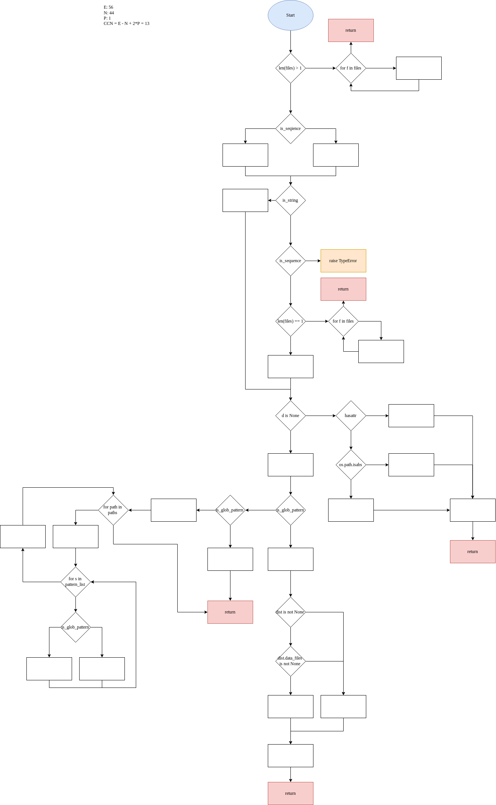

# Report for assignment 3


## Project


Name: numpy


URL: https://github.com/nicklashersen/numpy/tree/doc


NumPy is the fundamental package needed for scientific computing with Python.


## Onboarding experience
        
Overall it did not take too long to get started with the project. However, we feel like the onboarding documentation could be improved since it is not clear from the README where to begin.


In order to build and run the project for development purposes; Python version 3 together with Cython and pytest where required. These requirements may not be regarded as additional tools so any documentation for these should not be needed. Although it is briefly described how to install these.


The build script did not install any other components other than the manually installed requirements.


Once the requirements had been installed the project built without any errors.


Using the runtests.py script different examples and tests could easily be run. Usage of this script is even documented within the file it self. Running all tests takes approximately 1-2 minutes on our systems.


## Complexity


Ten python functions with high (>15)  _cyclomatic complexity_ (CNN) according to lizard:

```
================================================
  NLOC    CCN   token  PARAM  length  location
------------------------------------------------
     59     18    375      2     150 add_data_files@1184-1333@./distutils/misc_util.py
     61     22    467      2     120 add_data_dir@1054-1173@./distutils/misc_util.py
     49     17    363      1      57 finalize_options@86-142@./distutils/command/build_src.py
     41     16    311      3      80 CCompiler_customize@468-547@./distutils/ccompiler.py
     52     20    420      3      54 get_paths@663-716@./distutils/system_info.py
     65     17    392      1      71 get_atlas_version@1465-1535@./distutils/system_info.py
     47     17    294      1      63 setup@109-171@./distutils/core.py
     35     16    272      4      56 _exec_command@265-320@./distutils/exec_command.py
     38     16    245      2      55 _scalar_str@115-169@./core/_dtype.py
     34     17    238      1      57 long_double_representation@345-401@./core/setup_common.py
```
  


### Manual cyclomatic complexity

The cyclomatic complexity of a function can be calculated through two different methods:


1. \pi - s + 2, where \pi is the number of decisions made. s is the number of terminating statements.
2. Drawing the control flow graph and calculating CNN = E - N + 2 * P, where E is the number of edges in the graph. N is the number of nodes in the graph. P is the number of connected components in the graph.

When calculating the CCN for five different functions by hand the results differed a little from the Lizard ones. We used the first method mentioned whereas Lizard probably uses another method, hence the differ in the result. An example for this might be that the function supports many different file path formats (absolute- and relative file name, etc.) which results in a lot of branches. The most of the functions we calculated are moderately long but is mostly made up of if-statements. The purpose of the functions we checked are add data files to configuration_data_files, add files under `data_path` to the list of `data_files` to be installed (and distributed), setting build settings etc. The documentation for the different functions are not fully complete but is sufficient. 

#### add\_data\_file 

The function `add_data_file` in `numpy/distutils/misc_utils.py` adds data files to configuration\_data\_files. The function has a cyclomatic complexity number (CCN) of 13 and is moderately long. Accoring to lizard the CCN of the function should be 18 which implies that lizard probably calculates the CNN in some other way. Exceptions were taken into consideration during the calculation. A possible reason for the high CCN could be that the function supports many different file path formats (absolute- and relative file name, etc.) which results in a lot of branchs. As seen in the functions  control flow graph below a lot of the branchs terminates. We could improve CCN of the function by simply splitting these branches into separate functions.



#### finalize\_options 

The function `finalize_options` in `numpy/distutils/command/build_src.py` is not documented but the file `build_src.py` is used for building swig and f2py sources. The `finalize_options` function seems to be setting build settings for building these sources. The function has a cyclomatic complexity number (CCN) of 17 and is moderately long but is mostly made up of if-statements. `lizard` gives the same cyclomatic complexity number (CCN) of 17. Since the function checks a lot of options to see if they are empty or not in order to either give that option the set value or a default value there are a lot of if-statements which explain the high CCN. There are no exceptions in the thrown function.

#### add\_data\_dir

The function `add_data_dir` in `numpy/distutils/misc_utils.py` recursively adds files under `data_path` to the list of `data_files` to be installed (and distributed). The function has a cyclomatic complexity number (CCN) of 15 and is moderately long consisting of mostly repetitive if-statements handling the different cases with its corresponding placements. The group was unanimous on the result but according to `lizard` the CCN of the function should be 22 implying that the function is more complex than meets the eye. We were using the formula stated above whereas the result of `lizard` might be due to the nested if- and for-statements creating more options and branches which it accounts for. The documentation of the function is generally presented in the beginning but doesn’t go into detail for the different branches. This is understandable being 33 different options.

#### CCompiler\_customize
The function `CCompiler_customize` customizes the compiler command depending on which computer the command is ran from. We got a CCN of 15 and the reason for this is that there are a lot of if-statement for different conditions depending on different operating systems and C compilers. The function is not very long but has a lot of if-statements. There are no thrown exceptions in this function. The documentations breifly describes what the function does but not the outcomes of different branches. Lizard reports a CCN of 16 which differs by 1 from our calculation.

#### get\_paths
The function `get_paths` returns the current environment PATH for a given type (src, library, etc). We got a CCN of 19 and the reason for this is that there are a lot of if-statements and loops for different types of paths an concatenated paths (with :). The function is quite long since it is quite complex and includes a lot of different cases and logic for concatenating paths. There are no thrown exceptions in the function. There is no documentation for this particular function. Lizard reports a CCN of 20 which differs by 1 from our calculation.

#### \_exec\_command
The function `_exec_command` executes a console or terminal command and returns the exit code and any text output generated by the process. A lot of the complexity is due to differences in tools and paths available on different operating systems. In order to execute a command the function has to figure out what operating system the user is running and use the tools available on that system. The complexity of the function could be reduced simply by splitting the function into smaller functions. 

#### get\_atlas\_version
The function `get_atlas_version` is a function that scans the environment in an attempt to find the installed ATLAS version on
the system. It does this by looking for artifacts such as files, folders or environment variables from an installed ATLAS 
version. Since there are many different artifacts to look/scan for, the function has become quite complex. The branch outcomes
are directly dependant on the method in which the version information is found. The resulted complexity is however not needed
since the different methods of finding the ATLAS version easily may be split up into smaller units, thus resulting in a lower
complexity of the function.

#### setup
The setup function loads configuration and libraries for the distribution utilities. It copies specified attributes (given as argument) from various configurations into configurations in the dist utility core (distutils.core). The function has a high cyclomatic complexity because it 1) copies a lot of different types of data (which could be split into separate functions) and 2) copies data from various places and data structures. It also has a high cyclomatic complexity because it has a lot of if-statements for the various attributes given in the arguments.

#### long\_double\_representation

The function `long_double_representation` in `numpy/core/setup_common.py`, given a binary dump as given by GNU od -b, the fuction looks for long double corresponding representaion. Just like many of the other functions it consists of many nested if- and for-statements. The function itself is not too long (50 LOC) but consists of alot of different cases dependant on the imput size of lines giving it many branches and hence being moderately complex (CCN = 17).

## Coverage tool 


As a tool we only used the coverage tool which worked for some of us and not for others. It was easy to use, but it was a drag reading the output. 


The documentation was enough to use the tool but could have been better.


### DYI
Our coverage tool checks the branch coverage by giving each branch a unique ID. When that branch is taken when a test is executed the branch ID is written to a file called testcoverage.txt. Calls to secoverage.write_coverage(branch_id) are used to perform the write to testcoverage.txt. The tool is embedded into the existing runtests.py script and is executed when the tests are executed.


What is the quality of your own coverage measurement? Does it take into account ternary operators (condition ? yes : no) and exceptions, if available in your language? Since our tool requires manual instrumentation of the source code to add the calls to secoverage.write_coverage(branch_id) it is up to the one inserting the calls to decide how many and what operations to support. Currently loops, if-statements and exceptions are supported. Ternary operators are rewritten to if-statements for the coverage to work. That way the quality of the coverage measurement depends on how many and where calls to secoverage.write_coverage(branch_id) are inserted. Since they are inserted at every branch-statement that we could find the quality should be quite good. However, some operators like assert are not supported.


What are the limitations of your tool? How would the instrumentation change if you modify the code? A limitation of the tool is that is does not display branch coverage as a percentage but instead as the IDs of the branches taken. In order to obtain a percentage of the branch coverage the IDs in testcoverage.txt would have to be counted and compared to the total number of IDs for each function in coveragespec.txt. Another limitation is that assertions aren't accounted for by the tool. If the implementation of the code would change the calls to secoverage.write_coverage(branch_id) would have to modified so that there is one for each branch taken. Then branch IDs might also need to be updated.


If you can use an automated tool (as well), are your results consistent with the ones produced by existing tool(s)? Our results are more or less consistent with the results generated by codecov which is used by numpy as a coverage tool. Sometimes our tool reports that a function or branch has been tested while codecov reports that it does not and sometimes codecov reports a branch as tested while our tool does not recognize it.

Patch: git diff 6c2ee88529265f0e002c9504973fe7679fef4c0a

### Evaluation


[Report of old coverage](./doc_resources/master_html/index.html)


[Report of new coverage](./doc_resources/develop_html/index.html)


Test cases added:

```
test_setup_type_error
test_get_paths_env_var_is_file
test_get_paths_env_var_is_not_file
test_CCompiler_customize_need_cxx_true_gcc
test_CCompiler_customize_need_cxx_true_gcc_no_cxx
test_CCompiler_customize_need_cxx_true_non_gcc
test_get_atlas_version
test_swig_opts
test_f2py_opts
test_command_sequence
test_no_locale
test_long_double_representation_value_error
test_long_double_representation_intel_extended_12b
test_data_dir_raises
test_data_files_raises
test_setup_dist_help
test_setup_ext_library_string
```

## Refactoring


Functions refactored:

```
add_data_files
add_data_dir
finalize_options
CCompiler:customize
get_paths
get_atlas_version
setup
_exec_command
_scalar_str
long_double_representaion
analyzeline
analyzevars
```

## Effort spent


In average the time spent for each team member:


1. plenary discussions/meetings; 5-6 hours


2. discussions within parts of the group; 
This is a hard estimation, but we were regularly in contact with each other using slack. 


3. reading documentation; 1-2 hours


4. configuration; around 1 hour.


5. analyzing code/output; 2-3 hours


6. writing documentation; 2 hour


7. writing code; 20 hours (in average)


8. running code? 1 hour 
(we had a large test base and all the tests took around 1 min to run.)


## Overall experience


Using coverage tools. Don’t create too many branches. Improved python skills.
